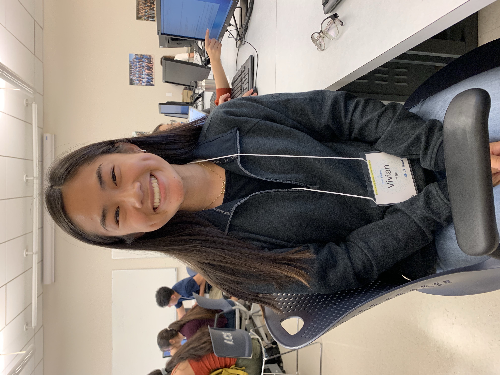

# practice-vivian-y
Hi, my name is Vivian Yan and I'm from San Leandro, CA, a small town just south of Oakland. I am really excited to learn the different components of computer science, especially how to code using different languages. I am also looking forward to improving my mathematical reasoning and logical skills and learn how to appropriately apply them. I love to hike, go to the beach, and watch movies, so it would be cool if we could do that during our non-academic sessions. 

